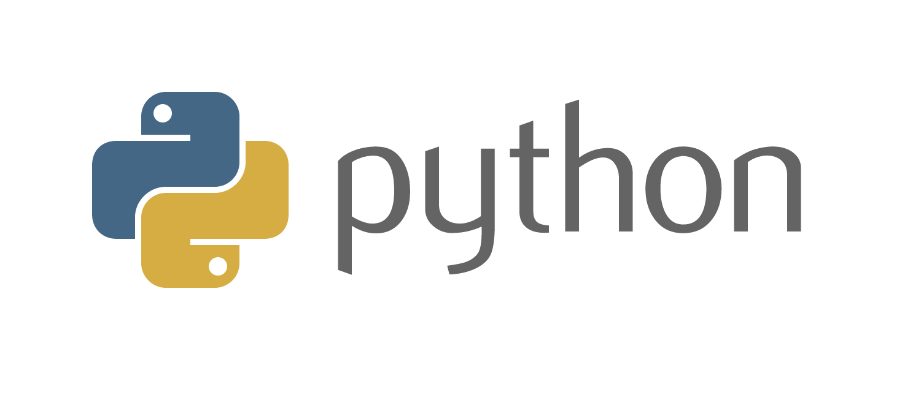

# python-3.8.0
My works related to Python programming language | version 3.8.0

## Table of contents
1. [Introduction.](#introduction)
2. [Python principle.](#principle)
3. [Official references websites.](#references)

## Introduction
Python is a multi-paradigm programming language. Object-oriented programming and structured programming are fully supported, and many of its features support functional programming and aspect-oriented programming (including by metaprogramming and metaobjects (magic methods)). Many other paradigms are supported via extensions, including design by contract and logic programming. Python uses dynamic typing and a combination of reference counting and a cycle-detecting garbage collector for memory management. It also features dynamic name resolution (late binding), which binds method and variable names during program execution.

## Python principle
Beautiful is better than ugly.  
Explicit is better than implicit.  
Simple is better than complex.  
Complex is better than complicated.  
Flat is better than nested.  
Sparse is better than dense.  
Readability counts.  
Special cases aren't special enough to break the rules.  
Although practicality beats purity.  
Errors should never pass silently.  
Unless explicitly silenced.  
In the face of ambiguity, refuse the temptation to guess.  
There should be one—and preferably only one—obvious way to do it.  
Although that way may not be obvious at first unless you're Dutch.  
Now is better than never.  
Although never is often better than right now.  
If the implementation is hard to explain, it's a bad idea.  
If the implementation is easy to explain, it may be a good idea.  
Namespaces are one honking great idea—let's do more of those!

## Official references websites

Python official website : https://www.python.org

Python IdleX text editor website : http://idlex.sourceforge.net/
